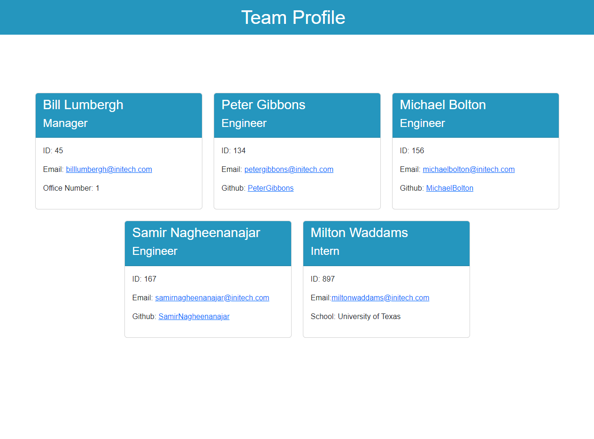

# Team Profile Generator

## Description:
A Node.js command-line application that takes in information about employees on a software engineering team and generates an HTML webpage that displays summaries for each person.
## Table of Contents:
* [Installation](#installation)
* [Usage](#usage)
* [License](#license)
* [Contributing](#contributing)
* [Tests](#tests)
* [Questions](#questions)
### Installation:
git clone https://github.com/Samualjensen/Team-Profile-Generator.git
### Usage:
https://user-images.githubusercontent.com/115045713/212449777-a61f645c-15eb-4a2f-9b75-2ed7599bd63c.mp4

### License
MIT
### Contributing
N/A
### Tests
npm run test
### Questions
My Github profile can be found at [Github](https://github.com/Samauljensen), or contact Sam Jensen at samual.jensen@gmail.com.
